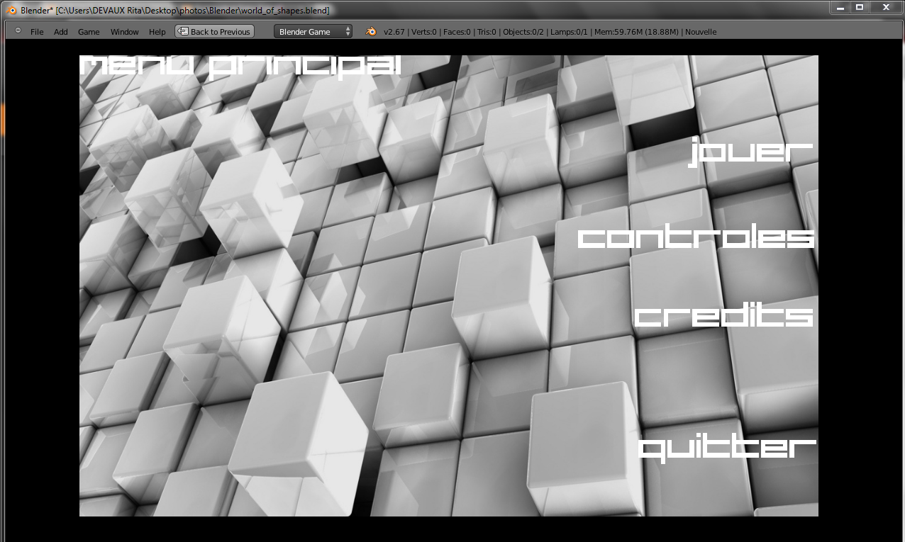
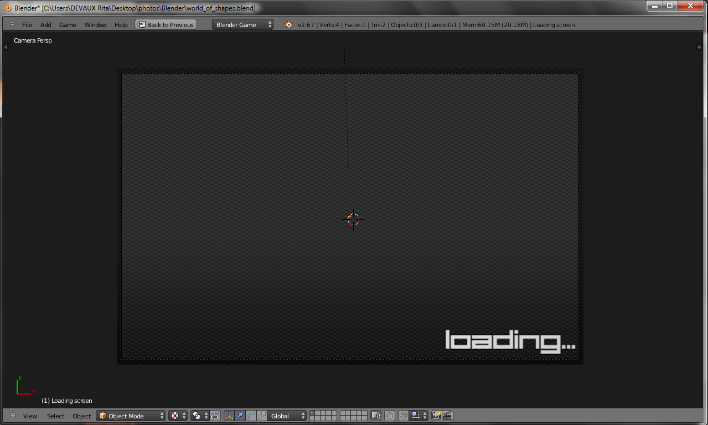
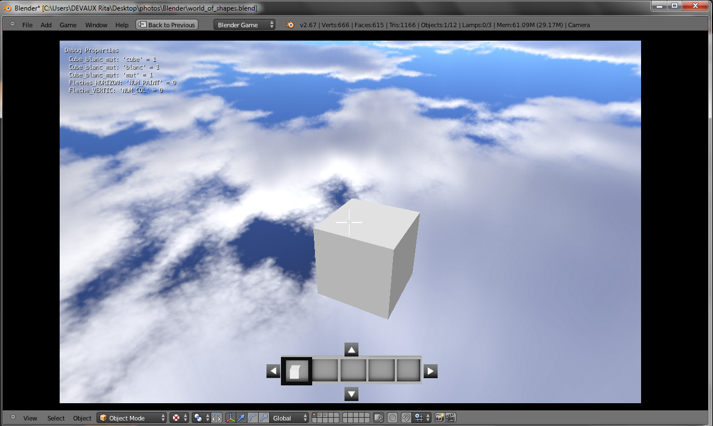
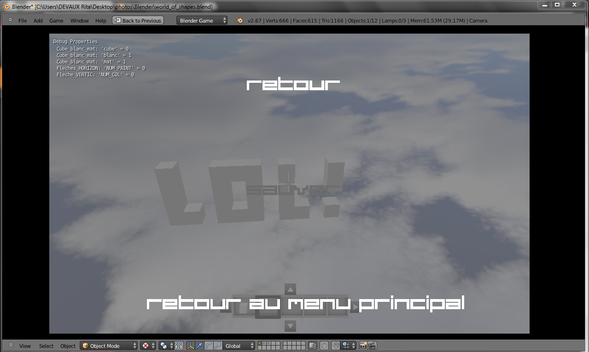

# World of Shapes
Video game based on the same mechanics of Minecraft. 
It is a demo and the development stopped a very long time ago.
It has been developed with Blender and Python. Anyone who watns to tru or to contribute is welcome.

## Source
You may find the source in file **world_of_shapes - Beta1.0.blend**
You need to have blender installed on your machine. Please visit https://www.blender.org/

## Windows
If you are using Windows, you may run **/W.O.S_Beta1.0(Windows)/world_of_shapes.exe**
Download here :  https://drive.google.com/open?id=0BzfsWX4zvp5pM292VjRCd1JSdGc

## Linux
If you are using Linux, you may run **/W.O.S_Beta1.0(Linux)/world_of_shapes - Beta1.0**
Download here : https://drive.google.com/file/d/0BzfsWX4zvp5pekRlaGJnSDRUc0U/edit?resourcekey=0-NJUP6Wnu8gdXHtYPVGjFvA

